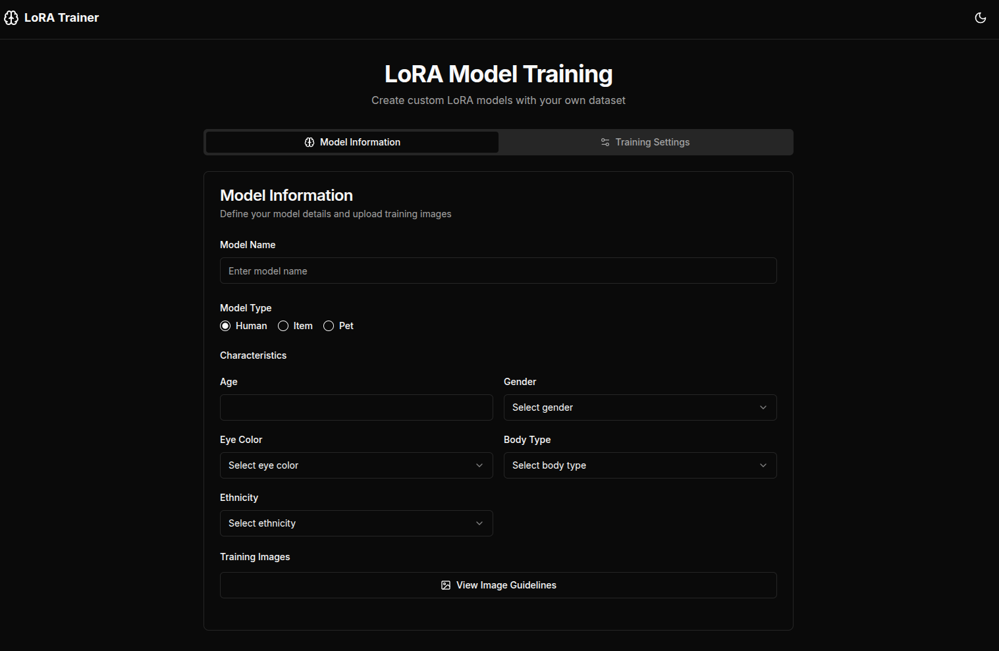

# FLUX LoRa Training Tool



## Overview

FLUX LoRa Training Tool is a powerful web application designed to simplify the process of training and fine-tuning LoRA (Low-Rank Adaptation) models for Flux. 
This tool makes it easy for artists, designers, and AI enthusiasts to create 
custom AI models trained on their own image datasets, enabling personalized 
image generation capabilities.

The tool leverages the XAI API to automatically generate detailed image descriptions by combining user-provided characteristics with image analysis, enhancing the quality of model training. All model training is performed securely through Replicate's API infrastructure. For user privacy and security, no API keys are stored or shared in any way - they are only used during the active training session.

## Why Use FLUX LoRa Training Tool?

- 🚀 **User-Friendly Interface**: Simple and intuitive web interface for training LoRA models without command-line complexity
- 🎨 **Custom Model Creation**: Train models on your specific art style, character, or concept
- 📊 **Real-time Monitoring**: Track training progress and model performance in real-time
- 🔄 **Efficient Workflow**: Streamlined process from image upload to model training
- 💾 **Easy Export**: Download and use your trained models even at your own 
personal computer.

## Technologies Used

### Frontend
- **Next.js 13**: React framework with server-side rendering
- **TypeScript**: For type-safe code
- **Tailwind CSS**: For responsive and modern UI design
- **Radix UI**: For accessible component primitives
- **React Hook Form**: For form handling and validation

### Backend
- **Flask**: Python web framework for the API
- **Flask-CORS**: For handling cross-origin requests
- **XAI**: For generating captions for the images
- **Replicate**: For model training and inference
- **Python**: Core backend language

## Getting Started

### Prerequisites
- Node.js (v16 or higher)
- Python 3.10 or higher
- pip (Python package manager)


### Running the Application

1. **Start the Backend**
   ```bash
   cd backend
   python app.py
   ```

2. **Start the Frontend**
   ```bash
   cd Frontend
   npm run dev
   ```

3. Access the application at `http://localhost:3000`

## Usage Guide

1. **Configure Training Settings**
   - Set your model name
   - Set your model type and characteristics
   - Adjust training parameters (epochs, learning rate, etc.)
   - Insert your API keys
  

2. **Upload Images**
   - View the image guidelines and accept them
   - Click on the upload button
   - Select or drag-and-drop your training images zip file

3. **Start Training**
   - Review your settings
   - Click "Start Training"
   - Monitor the training progress through the replicate website link

4. **Export and Use**
   - Once training is complete, you can run your model in Replicate or
   download your model

<!-- ## Example Results

[Insert Collage of Example Generated Images Here] -->


## License

This project is licensed under the Apache License 2.0 - see the [LICENSE.md](LICENSE.md) file for details.


Licensed under the Apache License, Version 2.0 (the "License");
you may not use this file except in compliance with the License.
You may obtain a copy of the License at

    http://www.apache.org/licenses/LICENSE-2.0

Unless required by applicable law or agreed to in writing, software
distributed under the License is distributed on an "AS IS" BASIS,
WITHOUT WARRANTIES OR CONDITIONS OF ANY KIND, either express or implied.
See the License for the specific language governing permissions and
limitations under the License.

